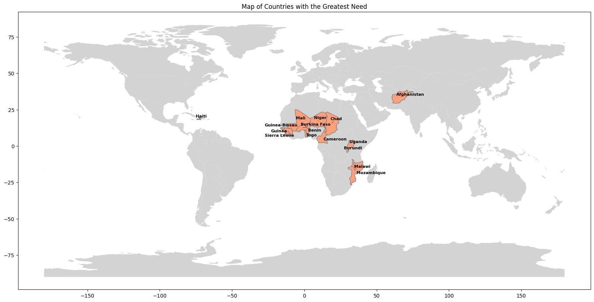

# K-means and Hierarchical Clustering of Country Data

This Jupyter Notebook (`country.ipynb`) performs K-means and Hierarchical clustering on a dataset of countries. It includes data preprocessing, clustering analysis, and visualization to identify meaningful groups of countries based on various features.

## Project Overview

The notebook covers:
- Data loading and exploration
- Data preprocessing (scaling, normalization)
- Hierarchical clustering with dendrograms
- Evaluation using silhouette scores
- Visualization of clusters using PCA and 3D plots

## Data

The dataset (country_data.csv) should be placed in the same directory as the notebook.
It contains country-level indicators used for clustering.

## Results

The notebook generates:

- Cluster assignments for each country
- PCA-based 3D visualizations of clustered data
- Silhouette score analysis for cluster quality assessment
- Dendrograms for hierarchical clustering
- Map of countries with the greatest need


## Presentation Slides

- View the project presentation here: [Presentation Slides](https://docs.google.com/presentation/d/1kqSzP4jR4UrOXZsSKay9vFsHb9rHyQJVM2P4i_OVAig/edit?usp=sharing)

## Requirements

To run this notebook, install the required dependencies:

```bash
pip install requirements

